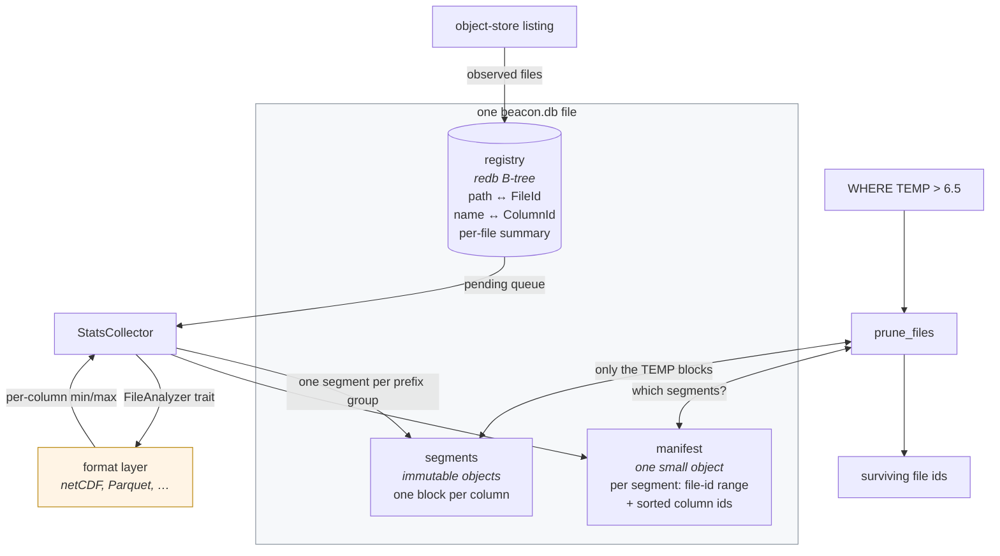
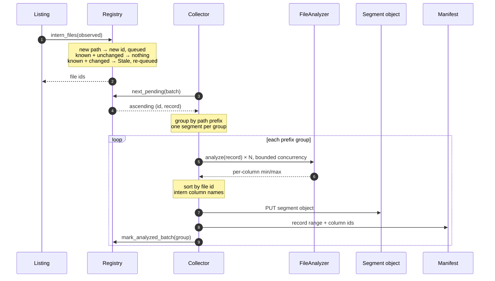
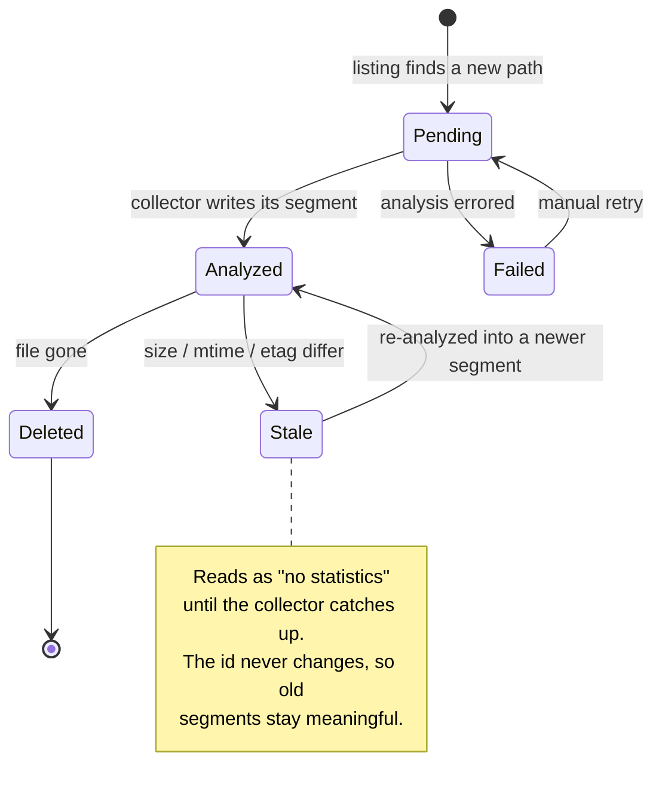
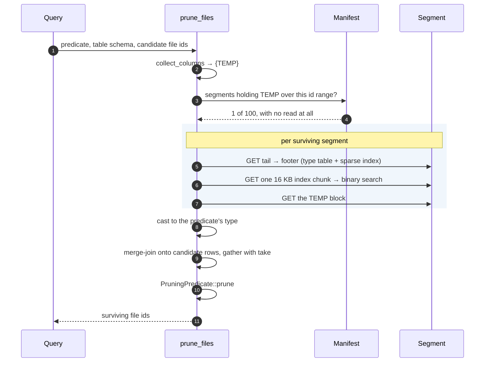
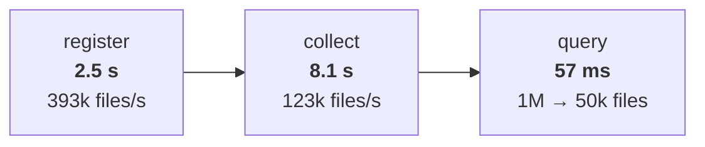
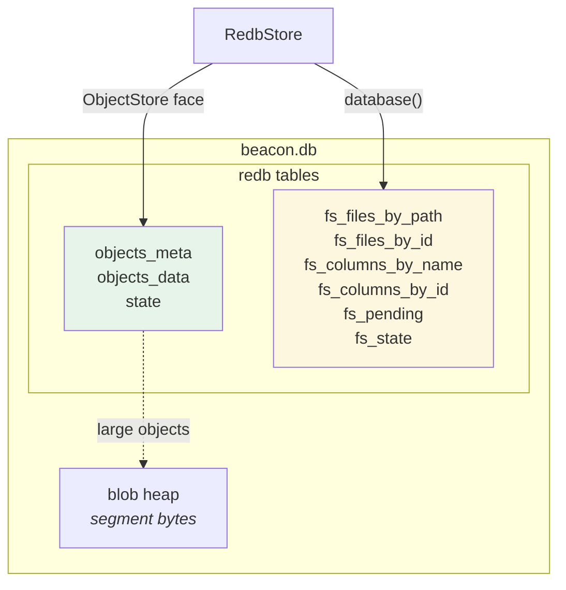

# beacon-file-stats: how it works

A visual companion to [README.md](README.md). The README argues the design; this
draws it.

---

## 1. The constraint everything follows from

A Beacon node holds ~1M files drawing on ~160 000 distinct column names. Each
file declares maybe 20 to 50 of them.

Drawn as a matrix, almost all of it is empty:

```text
              core_0  core_1   fam0_var3  fam0_var9  ...  fam99_var1599
 file      0    ███     ███       ███        ·                 ·
 file      1    ███     ███        ·        ███                ·
 file      2    ███     ███       ███        ·                 ·
     ...        ...     ...       ...       ...               ...
 file 999999    ███     ███        ·         ·                ███

                └── wide ──┘      └────── the sparse tail ──────┘
                declared by       declared by a few dozen files each
                every file
```

- `███` = a real statistic. **20 million of them.**
- `·` = nothing. **160 billion of them.**

Storing the `·` cells is impossible. Storing only the `███` cells costs 780 MB.
That ratio, measured at **8000x**, is the whole design.

---

## 2. The pieces



The amber box is the seam. Reading a real file's statistics needs DataFusion,
so this crate does not do it. It takes a `FileAnalyzer` and Beacon supplies one.

| Piece | Shape | Answers |
|---|---|---|
| `registry` | B-tree | "what id is this path, and how many rows does it have?" |
| `manifest` | one small object, held in memory | "which segments need reading at all?" |
| `segment` | immutable objects, read by byte range | "what are this column's ranges, per file?" |

---

## 3. The write path



Two orderings in there are load-bearing:

**The segment is written before the files are marked analyzed.** A crash between
the two leaves the files pending, so the next pass writes them into a second
segment. Wasted work, never a wrong answer. The reverse order would lose
statistics outright.

**The batch is marked in one transaction.** A redb commit is an fsync. Marking
per file capped the collector at ~250 files/s; per group it does 123 000/s.

### Why one segment per prefix group

```text
prefix-local batching              scattered batching
(argo/2024, ctd/2024, …)           (whatever arrived next)

seg 0 │ ████░░░░░░░░░░░░           seg 0 │ ██░██░██░██░██░█
seg 1 │ ░░░░████░░░░░░░░           seg 1 │ █░██░██░██░██░██
seg 2 │ ░░░░░░░░████░░░░           seg 2 │ ██░██░█░██░██░██
seg 3 │ ░░░░░░░░░░░░████           seg 3 │ ░██░██░██░██░██░
        └── column space ──┘               └── column space ──┘

WHERE on a column in seg 1:        WHERE on any column:
  reads 1 of 4 segments              reads 4 of 4 segments
```

Measured in `tests/scale.rs`: **1 of 4** against **4 of 4**. Same data, same
predicate, different batching. This is the rule most likely to be broken by
accident, because it looks fine at small scale.

---

## 4. The file lifecycle



An etag settles "did this change" when both sides carry one. Size and
last-modified settle it otherwise. **A doubtful match counts as changed**,
because a wrong "unchanged" prunes real rows away.

---

## 5. The read path

`WHERE TEMP > 6.5`, against a store with 160 000 column names:



**Two ranged reads per column lookup**, and the count does not grow with the
segment's width. It measures identical at 100 columns and at 8000. Nothing reads a
column the predicate did not name. Nothing reads a segment without `TEMP`.

### Inside a segment

```text
byte 0                                                              end
  ┌───────┬──────────┬──────────┬─────┬──────────┬────────┬─────────┐
  │ MAGIC │ block 0  │ block 1  │ ... │  column  │ footer │ trailer │
  │  (8)  │          │          │     │  index   │ (rkyv) │         │
  └───────┴──────────┴──────────┴─────┴──────────┴────────┴─────────┘
              ▲                          ▲            ▲        ▲
              │                          │            │        │
     one column's stats,        16-byte records,  type table   len + MAGIC
     8-byte aligned             sorted by         + sparse
                                column_id         index

  a block, in detail:
  ┌────────────┬──────────┬──────────┬────────────┬───────────┬──────┬─────┐
  │ file_ids   │ min      │ max      │ null_count │ row_count │ rkyv │ len │
  │ u64, asc   │ narrow   │ narrow   │ u64        │ u64       │ meta │ u32 │
  └────────────┴──────────┴──────────┴────────────┴───────────┴──────┴─────┘
   └──── one entry per file that declares this column, and no others ────┘
```

Buffers come **first** and metadata **last**. That avoids a two-pass layout:
buffer offsets are known before the metadata that records them is built.

### Why the buffers sit outside the rkyv metadata

```text
  nested in rkyv                        placed by the writer
  ┌──────────────────────┐              ┌──────────────────────┐
  │ rkyv struct          │              │ buffer   @ 0x…000 ✓  │  8-aligned
  │  ├ Vec<u8> @ 0x…3d1  │  ✗ align 1   │ buffer   @ 0x…018 ✓  │
  │  └ Vec<u8> @ 0x…4a7  │  ✗ align 1   │ rkyv meta { off, len}│
  └──────────────────────┘              └──────────────────────┘
   ScalarBuffer<T> asserts               a typed Arrow view needs
   align_of::<T>() → copy on             no realigning copy
   every read
```

Alignment still cannot be guaranteed end to end, because the base address of the
`bytes::Bytes` an object store returns belongs to the allocator. The reader
checks the pointer and copies only when it must.

---

## 6. Folding segments onto the answer

The candidate ids and each block's file ids are both sorted, so the join is a
merge, not a hash:

```text
candidates   :  0    1    2    3    4    5          (the caller's row order)
                │    │    │    │    │    │
block file_ids :     1         3    4               (only these declare TEMP)
                │    │    │    │    │    │
indices        : ∅    0    ∅    1    2    ∅
                     │         │    │
                     ▼         ▼    ▼
take(min, indices) → [null, 20.0, null, 5.0, 8.0, null]
                       ▲                          ▲
                       └─ no statistic ──────────-┘
                          reads back null
                          → the engine treats it as unknown
                          → the file is KEPT
```

That last arrow is the safety rule the whole crate obeys:

> **An absent statistic keeps a file.**
>
> A file wrongly dropped is a silently wrong answer. A file wrongly kept is one
> scan the optimizer would have skipped. The two are not comparable, so every
> path fails open.

Segments fold oldest first, so a file re-analyzed after a change takes its
**newest** range. The stale row is not wrong, just looser.

---

## 7. What it costs, measured at a million files

From `examples/scale_million.rs`: 1M files, 100 families, ~160 000 column names,
20 columns per file.



| | |
|---|---|
| registry | 514 MB |
| segments | 780 MB over 100 objects, **40.9 bytes/cell** |
| **manifest** | **0.6 MB** |
| columns interned | 160 010 |
| path → id → record | 7.2 µs |
| peak memory | ~1.0 GB |

The manifest is the number that mattered most. It was the part of the design
most likely to fail: a manifest holding per-column min/max per segment would be
16M entries here, and the metadata would have cost more than the data it guards.

---

## 8. Where pruning pays, and where it does not

```text
          candidates                                    kept
          ══════════                                    ════

core_3 > 9500          ████████████████████ 1 000 000    ██ 50 000
(every file declares)                                    20× fewer files to open

fam7_var300 > 9000     ████████████████████ 1 000 000    ███████████████████ 999 943
(≈62 files declare)                                      correct, and useless

fam7_var300 > 9000     ██ 10 000                         ██ 9 943
(one family's files)                                     correct, cheap, still little use
```

**Pruning power is bounded by how many candidate files declare the column.**
Because an absent statistic keeps a file, a column that 0.6% of the candidates
declare can only ever prune 0.6% of them.

This is not a defect to fix. It is what a sparse column space means. The win
concentrates on columns widely declared *inside the set being scanned*. That is
exactly what people filter on: time, latitude, depth.

The practical consequence:

> The candidate list should come from **the table being scanned**, not from the
> whole instance.

---

## 9. Living in one file



Green is the store's own. Yellow is the tenant's. Copy the one file and the
statistics come with it.

### The trap this opened

`RedbStore::vacuum` rewrites the whole file by copying its own three tables into
a fresh one. Any tenant table was **dropped with no error and no warning**. That is the
worst shape a bug can take.

Fixed, with a contract a tenant must follow:

| Rule | Why |
|---|---|
| Prefix your table names | `objects_meta`, `objects_data`, `state` are taken |
| Declare tables as `TableDefinition<&[u8], &[u8]>` | A vacuum cannot know your types, and redb type-checks a definition against the stored one |
| Encode integer keys big-endian | redb orders byte keys lexicographically; the collector's queue needs numeric order |
| Drop the handle before a vacuum | A rewrite replaces the file; `vacuum` now refuses rather than corrupting |

---

## 10. Where the code is

| File | Holds |
|---|---|
| `src/registry.rs` | the redb tables, id allocation, the pending queue |
| `src/segment/format.rs` | the byte layout and the archived metadata |
| `src/segment/writer.rs` | `SegmentBuilder`, the sparse accumulator |
| `src/segment/reader.rs` | the two-level index lookup |
| `src/segment/values.rs` | `StatScalar` ↔ Arrow buffers |
| `src/scalar.rs` | the super-type rules that make a block homogeneous |
| `src/manifest.rs` | the skip test |
| `src/collector.rs` | the background pass |
| `src/pruning.rs` | the `PruningStatistics` adapter (feature `datafusion`) |
| `examples/walkthrough.rs` | ten files, end to end, printed |
| `examples/scale_million.rs` | a million files, end to end, timed |
